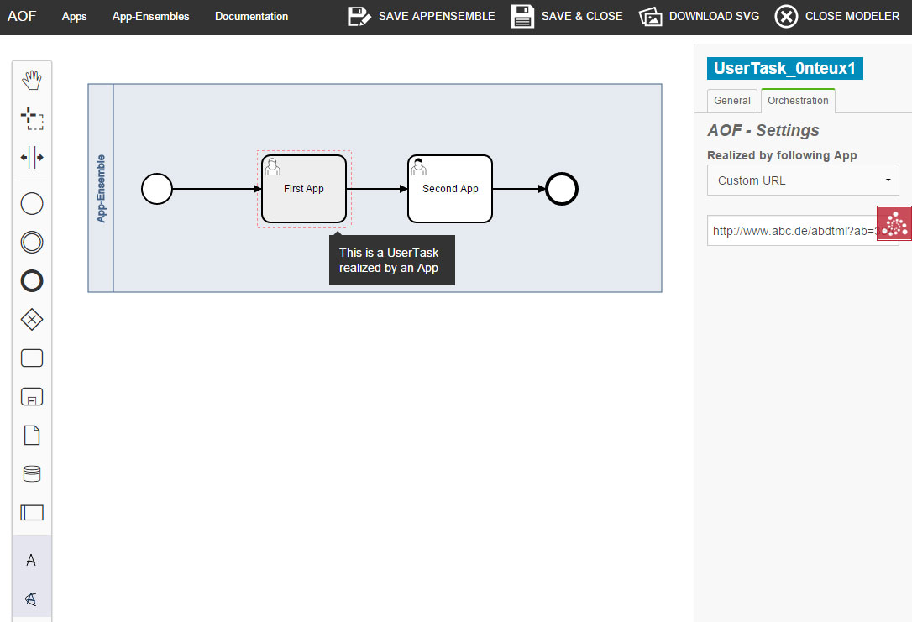

# bpmn-js Modeler with customization for the [AOF] (https://github.com/plt-tud/aof)

This project uses [bpmn-js](https://github.com/bpmn-io/bpmn-js) to implement a modeler for BPMN 2.0 process diagrams. 
The base structure is taken from the [bpmn-js modeler example] (https://github.com/bpm-io/bpmn-js-examples/tree/master/modeler)

## About

This example is a node-style web application that builds a user interface around the bpmn-js BPMN 2.0 modeler customized for the AOF



## Building

You need a [NodeJS](http://nodejs.org) development stack with [npm](https://npmjs.org) and [grunt](http://gruntjs.com) installed to build the project.

To install all project dependencies execute

```
npm install
```

Build the application (including [bpmn-js](https://github.com/bpmn-io/bpmn-js)) using [browserify](http://browserify.org) via

```
grunt
```

You may also spawn a development setup by executing

```
grunt auto-build
```

Both tasks generate the distribution ready client-side modeler application into the `dist` folder.

Serve the application locally or via a web server (nginx, apache, embedded).

## License

MIT